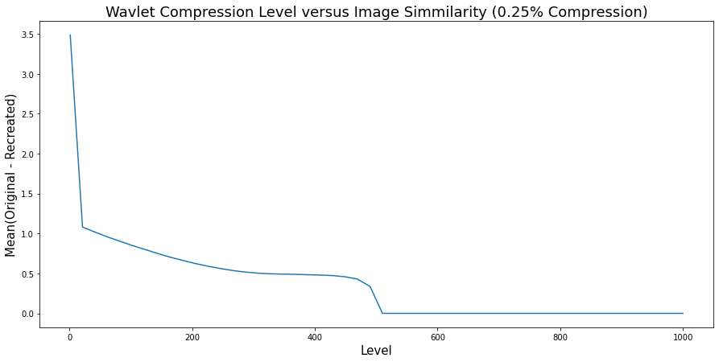

# DWT-IMAGE-COMPRESSION


This Notebook contains python code for compression and uncompressing images using Discrete Wavlet Transormations.

It makes use of the pywt library to conduct the wavlet transormations. 

-----------------------------------------------

The "Level 1 Wavlet Compression Demo" and "Level 1 Wavlet Compression Functions.ipynb" notebooks both cover full Wavlet Compression with different thresholds. The "Multilevel Image Compression.ipynb" notebook covers Wavlet Compressions at multiple wavlet levels. (Higher the wavlet level, more accurate the compression, but the longer it takes).

-----------------------------------------------

The [DWTCompression](DWTCompression.py) file contains the actual functions required to compress and uncompress images with Wavlet Compression

Heres an overview of usage for the 4 functions in that file:

# 

<u>The First 2 functions are for applying the wavlet compression and uncompression to images</u>

##

1. ```compress_image(image, level, compression_threshold)```

```python
im = imread('rocket.jpg') # Opens sample Image

# Setting Wavlets level to 1 (Level can be between 1 and 1000; The higher the level the less the compression loss)
level = 1  


# Compresses Image into Wavlets and keeping only the top 60% of the wavlet coefficients
compressed_wavlets = compress_image(im, level = level, compression_threshold = 0.60) 

```


#

2. ```uncompress_image(compressed_image, level, im_shape)```

```python
# Reconstruct Original Image from Wavlets (with some amount of loss)
# You'll need to provide, in addition to the wavlets, the level used in the compression and the shape of the original image
reconstructed_image = uncompress_image(compressed_wavlets, level, np.shape(im)[:2])


# This returns the loss between the origina image, and the image reconstructed after wavlet compression
# The Loss is expressed as the Mean Pixel Difference between the 2 images; or Mean(Abs(Original-Reconstructed))
compression_loss = calculate_image_simmilarity(im, reconstructed_image)
```


# 

<u>The Following 2 Functions are for visualizing the compress loss versus the wavlet level and threshold</u>

##


3. ```wavlet_level_graph(im, level_min, level_max, compression_threshold, resolution=20)```

```python
wavlet_level_graph(im, level_min = 1, level_max = 1000, compression_threshold = 0.1, resolution=50)

# The Command should return:
```

